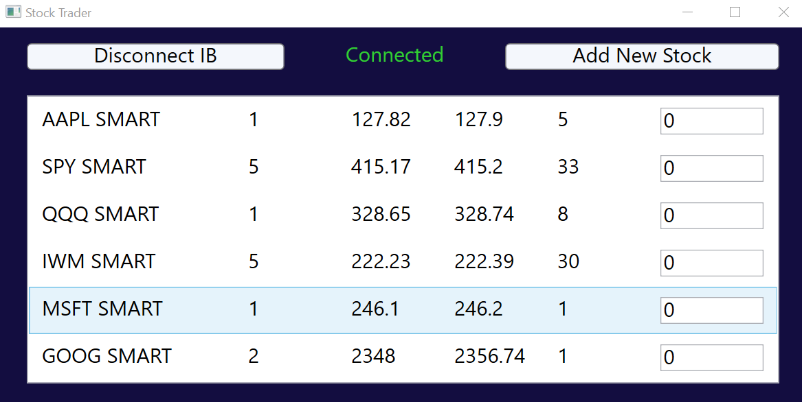
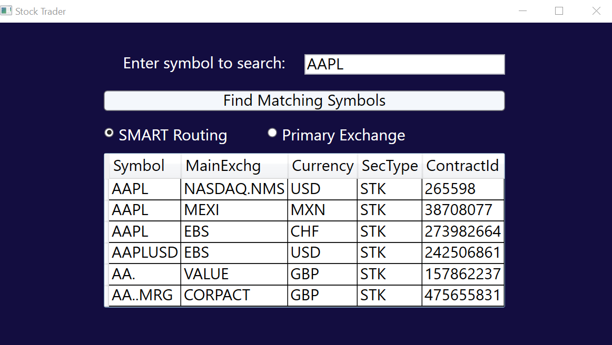

# Interactive Brokers API

_Disclaimer:_

_Trading is risky, so do not engage in any trading activities without first consulting a professional. This project is meant for **EDUCATIONAL PURPOSES ONLY** and is not intened to be used with a real money account. Use an Interactive Brokers' simuation account if you would like to try this, or any, API client. The author(s) of this API are not intending for anyone to use this code, in any way, on a live money account, and therefore are not responsible for any losses incurred as a result of using this code. Clone, copy, and make pull requests at your own risk._

## CSharp Client

Microsoft.NETCore.App 3.1.0
Uses **TWS API - Version 9.76.01 - CSharp** dll reference.
Requires an appsettings.json file with IB connection settings:

```
{
    "IbPort": "your_port",
    "IbConnectionId": "any_integer",
    "AccountNumber": "your_account_id"
}
```




## Python Client

Python 3.9.1
Uses dependencies found in _requirements.txt_.
Requires an ib_api_config.py file in the client root directory with IB connection settings:

```
class Config:
    IB_PORT = your_port
    IB_CONNECTION_ID = any_integer
```
